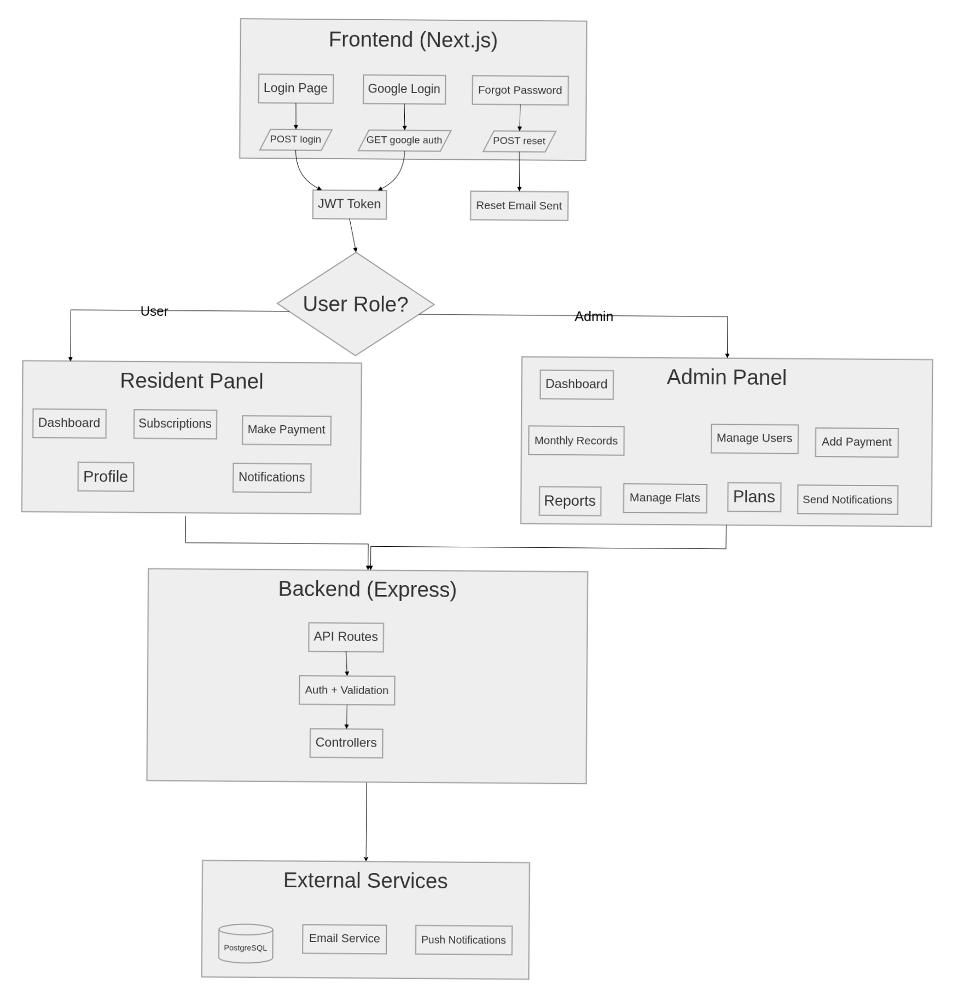
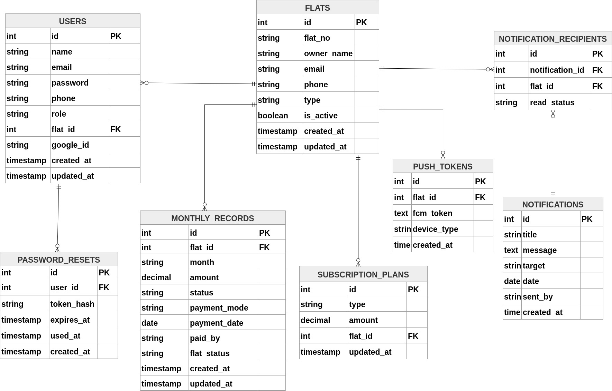

# 🏘️ Society Management System — Parasdeep Society

A full-stack **Society Subscription Management** application with a **Resident Portal** and an **Admin Portal** to manage flats, subscription plans, monthly dues, payments, notifications (email + push), and financial reports.

---

## 📑 Table of Contents

- [Overview](#-overview)
- [Video Demo](#-video-demo)
- [Tech Stack](#-tech-stack)
- [Project Structure](#-project-structure)
- [Getting Started](#-getting-started)
- [Roles & Permissions](#-roles--permissions)
- [Features](#-features)
- [API Endpoints](#-api-endpoints)

---

## 🔭 Overview

Society Management System is designed for **residential societies** to digitally manage subscription payments and day-to-day operations. It provides:

- **Admin Portal** — Manage flats, residents, subscription plans, monthly dues, payments, reports, and send email/push notifications.
- **Resident Portal** — View dashboard, check subscription history, make payments, receive notifications, and update profile.


---

## 🎬 Video Demo

> **📹 Coming Soon** — A recorded walkthrough of both the Admin and Resident portals will be added here.

<!-- Replace with your video link or embed -->
<!--  -->

---

## 🛠️ Tech Stack

### Frontend

| Technology       | Version  | Purpose                           |
| ---------------- | -------- | --------------------------------- |
| **Next.js**      | 16.1.6   | React framework with App Router   |
| **React**        | 19.2.3   | UI library                        |
| **TypeScript**   | ^5       | Type safety                       |
| **Tailwind CSS** | ^4       | Utility-first styling             |
| **Axios**        | ^1.12.2  | HTTP client with JWT interceptor  |
| **Firebase**     | ^12.10.0 | Push notifications (FCM web)      |
| **Recharts**     | ^3.8.0   | Dashboard charts & visualizations |
| **React Icons**  | ^5.6.0   | Icon library                      |

### Backend

| Technology          | Version | Purpose                            |
| ------------------- | ------- | ---------------------------------- |
| **Express**         | 5.2.1   | REST API framework                 |
| **PostgreSQL (pg)** | ^8.20.0 | Relational database                |
| **JSON Web Token**  | ^9.0.3  | JWT authentication                 |
| **Passport**        | ^0.7.0  | Google OAuth 2.0 strategy          |
| **Zod**             | ^4.3.6  | Request body validation            |
| **bcryptjs**        | ^3.0.3  | Password hashing                   |
| **Nodemailer**      | ^8.0.2  | Email notifications (SMTP)         |
| **Firebase Admin**  | ^13.4.0 | Server-side FCM push notifications |
| **Nodemon**         | ^3.1.14 | Dev hot-reload                     |

---

## 📁 Project Structure

```

├── client/                              # Next.js Frontend
│   ├── app/
│   │   ├── (user)/                      # Resident Portal (protected)
│   │   │   ├── dashboard/page.tsx       #   Dashboard — summary & quick actions
│   │   │   ├── subscriptions/           #   Monthly dues list & detail
│   │   │   ├── pay-now/page.tsx         #   Online payment page
│   │   │   ├── profile/page.tsx         #   User profile management
│   │   │   └── layout.tsx               #   Resident sidebar + nav layout
│   │   │
│   │   ├── admin/(protected)/           # Admin Portal (protected)
│   │   │   ├── dashboard/page.tsx       #   Admin dashboard & overview
│   │   │   ├── flats/page.tsx           #   CRUD flats management
│   │   │   ├── subscriptions/page.tsx   #   Subscription plan management
│   │   │   ├── monthly-records/page.tsx #   Monthly dues tracking
│   │   │   ├── payment-entry/page.tsx   #   Manual payment entry
│   │   │   ├── reports/page.tsx         #   Financial reports (CSV/PDF)
│   │   │   ├── notifications/page.tsx   #   Send email & push notifications
│   │   │   ├── profile/page.tsx         #   Admin profile management
│   │   │   └── layout.tsx               #   Admin sidebar + nav layout
│   │   │
│   │   ├── login/page.tsx               # Login page
│   │   ├── forgot-password/page.tsx     # Forgot password
│   │   ├── reset-password/page.tsx      # Reset password
│   │   ├── auth/                        # Google OAuth callback handler
│   │   │
│   │   ├── components/                  # Shared UI Components
│   │   │   ├── LoginForm.tsx            #   Login form (email + Google)
│   │   │   ├── ForgotPasswordForm.tsx   #   Forgot password form
│   │   │   ├── NotificationDropdown.tsx #   Bell icon + notifications list
│   │   │   ├── ConfirmModal.tsx         #   Reusable confirmation dialog
│   │   │   └── Toast.tsx                #   Toast notification component
│   │   │
│   │   ├── context/                     # React Contexts
│   │   │   ├── AuthContext.tsx           #   Authentication state & JWT
│   │   │   ├── NotificationContext.tsx   #   Notification polling & state
│   │   │   ├── ForegroundNotificationContext.tsx  # FCM foreground listener
│   │   │   └── ThemeContext.tsx          #   Dark/light theme toggle
│   │   │
│   │   ├── hooks/                       # Custom React Hooks
│   │   │   ├── useForegroundNotification.ts  # FCM foreground hook
│   │   │   └── useRegisterPushToken.ts       # Push token registration
│   │   │
│   │   ├── lib/                         # Utilities & Configuration
│   │   │   ├── api.ts                   #   Axios instance + JWT interceptor
│   │   │   ├── data.ts                  #   Static data / constants
│   │   │   └── firebaseMessaging.ts     #   Firebase messaging setup
│   │   │
│   │   ├── globals.css                  # Global styles
│   │   ├── layout.tsx                   # Root layout
│   │   └── page.tsx                     # Home page (redirects to login)
│   │
│   ├── provider.tsx                     # Context providers wrapper
│   ├── public/                          # Static assets
│   ├── package.json
│   └── tsconfig.json
│
├── society-management-backend/          # Express.js Backend
│   ├── server.js                        # App entry point
│   │
│   ├── routes/                          # API Route Definitions
│   │   ├── auth.routes.js               #   /api/v1/auth
│   │   ├── flats.routes.js              #   /api/v1/flats
│   │   ├── plans.routes.js              #   /api/v1/plans
│   │   ├── records.routes.js            #   /api/v1/records
│   │   ├── payments.routes.js           #   /api/v1/payments
│   │   ├── notifications.routes.js      #   /api/v1/notifications
│   │   ├── reports.routes.js            #   /api/v1/reports
│   │   ├── users.routes.js              #   /api/v1/users
│   │   └── pushTokens.routes.js         #   /api/v1/push-tokens
│   │
│   ├── controllers/                     # Business Logic
│   │   ├── auth.controller.js           #   Login, OAuth, password reset
│   │   ├── flats.controller.js          #   Flats CRUD
│   │   ├── flats.me.controller.js       #   Resident's own flat
│   │   ├── plans.controller.js          #   Subscription plans
│   │   ├── records.controller.js        #   Monthly records & ensure
│   │   ├── payments.controller.js       #   Payment processing
│   │   ├── notifications.controller.js  #   Notifications (email + FCM)
│   │   ├── reports.controller.js        #   Financial reports
│   │   ├── users.controller.js          #   User creation (admin)
│   │   └── pushTokens.controller.js     #   FCM token registration
│   │
│   ├── middlewares/                     # Express Middleware
│   │   ├── auth.js                      #   JWT verify + adminOnly guard
│   │   └── validate.js                  #   Zod schema validation
│   │
│   ├── validators/                      # Zod Schemas
│   │   ├── auth.validator.js            #   Login & profile schemas
│   │   ├── flats.validator.js           #   Flat create/update schemas
│   │   └── users.validator.js           #   User creation schema
│   │
│   ├── config/                          # Configuration
│   │   ├── db.js                        #   PostgreSQL pool connection
│   │   ├── passport.js                  #   Google OAuth strategy
│   │   └── schema.sql                   #   Database schema (DDL)
│   │
│   ├── utils/                           # Utility Functions
│   │   ├── auth.js                      #   JWT sign/verify helpers
│   │   ├── email.js                     #   Nodemailer SMTP transport
│   │   └── fcm.js                       #   Firebase Admin FCM sender
│   │
│   └── package.json
│
└── README.md
```

---

## 🚀 Getting Started

### Prerequisites

- **Node.js** ≥ 18
- **PostgreSQL** ≥ 14
- **npm** or **yarn**
- Firebase project (for push notifications)
- SMTP credentials (for email notifications)
- Google OAuth credentials (for social login)

### 1. Clone the Repository

```bash
git clone https://github.com/iqbal7230/society-management.git
cd society-management-backend
```

### 2. Set Up the Database

```bash
# Create database
psql -U postgres -c "CREATE DATABASE society_management;"

# Run schema
psql -U postgres -d society_management -f society-management-backend/config/schema.sql
```

### 3. Configure Backend Environment

Create `society-management-backend/.env`:

```env
# Server
PORT=8000
CLIENT_URL=http://localhost:3000

# JWT
JWT_SECRET=your_jwt_secret_key
SESSION_SECRET=your_session_secret

# PostgreSQL
DB_HOST=localhost
DB_PORT=5432
DB_USER=postgres
DB_PASSWORD=your_db_password
DB_NAME=society_management

# Google OAuth
GOOGLE_CLIENT_ID=your_google_client_id
GOOGLE_CLIENT_SECRET=your_google_client_secret
GOOGLE_CALLBACK_URL=http://localhost:8000/api/v1/auth/google/callback

# Email (SMTP)
SMTP_HOST=smtp.gmail.com
SMTP_PORT=587
SMTP_USER=your_email@gmail.com
SMTP_PASS=your_app_password
FROM_EMAIL=noreply@society.com

# Firebase Admin (FCM)
FIREBASE_SERVICE_ACCOUNT_JSON=./service.key.json
FIREBASE_PROJECT_ID=your_firebase_project_id
```

### 4. Configure Frontend Environment

Create `client/.env`:

```env
NEXT_PUBLIC_API_URL=http://localhost:8000/api/v1

# Firebase Web (for push notifications)
NEXT_PUBLIC_FIREBASE_API_KEY=your_api_key
NEXT_PUBLIC_FIREBASE_AUTH_DOMAIN=your_project.firebaseapp.com
NEXT_PUBLIC_FIREBASE_PROJECT_ID=your_project_id
NEXT_PUBLIC_FIREBASE_STORAGE_BUCKET=your_project.appspot.com
NEXT_PUBLIC_FIREBASE_MESSAGING_SENDER_ID=your_sender_id
NEXT_PUBLIC_FIREBASE_APP_ID=your_app_id
NEXT_PUBLIC_FIREBASE_VAPID_KEY=your_vapid_key
```

### 5. Install & Run Backend

```bash
cd society-management-backend
npm install
npm run dev       # Starts on http://localhost:8000
```

### 6. Install & Run Frontend

```bash
cd client
npm install
npm run dev       # Starts on http://localhost:3000
```

### 7. Access the Application

| Portal          | URL                                 |
| --------------- | ----------------------------------- |
| Resident Portal | `http://localhost:3000/login`       |
| Admin Portal    | `http://localhost:3000/admin/login` |

---

## 🔐 Roles & Permissions

The system has **two roles** with distinct access levels:

| Feature                               |       Admin 🛡️       |       Resident 👤       |
| ------------------------------------- | :------------------: | :---------------------: |
| **Login (Email / Google)**            |          ✅          |           ✅            |
| **Forgot / Reset Password**           |          ✅          |           ✅            |
| **View / Edit Profile**               |          ✅          |           ✅            |
| **View Dashboard**                    | ✅ (Admin dashboard) | ✅ (Resident dashboard) |
| **Manage Flats (CRUD)**               |          ✅          |           ❌            |
| **Create Resident Users**             |          ✅          |           ❌            |
| **Manage Subscription Plans**         |          ✅          |           ❌            |
| **View Own Subscription Plan**        |          ❌          |           ✅            |
| **Ensure Monthly Records**            |          ✅          |           ❌            |
| **View Monthly Records (All Flats)**  |          ✅          |           ❌            |
| **View Own Monthly Records**          |          ❌          |           ✅            |
| **Mark Payment as Paid**              |          ✅          |           ❌            |
| **Make Online Payment**               |          ❌          |   ✅ (own flat only)    |
| **Manual Payment Entry**              |          ✅          |           ❌            |
| **View Financial Reports**            |          ✅          |           ❌            |
| **Export CSV / Print PDF**            |          ✅          |           ❌            |
| **Send Notifications (Email + Push)** |          ✅          |           ❌            |
| **Receive Notifications**             |          ❌          |           ✅            |
| **Mark Notifications as Read**        |          ✅          |           ✅            |

### Middleware Guards

- **`authenticate`** — Validates JWT from `Authorization: Bearer <token>` header.
- **`adminOnly`** — Checks `req.user.role === 'admin'`; returns `403` otherwise.
- **`validateRequest`** — Validates request body/params against Zod schemas.

---

## ✨ Features

### 🔑 Authentication & Security

- Email/password login with **bcrypt** hashing
- **Google OAuth 2.0** login via Passport.js
- **JWT-based** session management (stored in localStorage)
- Forgot password → email reset link (token with expiry)
- Reset password with hashed token verification
- Profile update (name, phone, password)

### 👤 Resident Portal

- **Dashboard** — Current month status (paid/pending), pending amount summary, quick "Pay Now" action
- **Subscriptions** — Monthly dues table with payment status, amount, mode, and date
- **Pay Now** — Select month and record online payment
- **Notifications** — Bell icon with unread count badge, dropdown list, mark as read
- **Push Notifications** — Browser foreground FCM push via toast
- **Profile** — Update name, phone, and password

### 🛡️ Admin Portal

- **Dashboard** — Society overview and key metrics
- **Flats Management** — Create, edit, soft-delete flats with owner details
- **Resident Users** — Create resident accounts linked to flats
- **Subscription Plans** — View and update plan amounts by flat type
- **Monthly Records** — Ensure records for a given month, view all flats, mark as paid
- **Payment Entry** — Manual payment recording (Cash / UPI / Online)
- **Reports** — Monthly/yearly financial summaries with CSV download and Print/PDF export
- **Notifications** — Send email + push notifications to all or selected flats
- **Profile** — Update admin profile

### 📊 Reports & Exports

- Filter by **month** (`YYYY-MM`) or **year** (`YYYY`)
- Totals breakdown by payment mode (Cash, UPI, Online)
- **CSV export** for spreadsheet analysis
- **Print / PDF** via browser print dialog

### 🔔 Notification System

- **Email** — SMTP via Nodemailer
- **Push** — Firebase Cloud Messaging (FCM) to registered browser tokens
- **In-App** — API polling with unread count badge on bell icon
- Target: **all flats** or **selected flats**

### 🎨 UI/UX

- **Dark / Light** theme toggle
- Responsive sidebar navigation
- Toast notifications for success/error feedback
- Confirmation modals for destructive actions
- Charts & visualizations with Recharts

---

## 📡 API Endpoints

> **Base URL:** `/api/v1`

### 🔑 Auth — `/api/v1/auth`

| Method | Endpoint                | Auth   | Description                                |
| ------ | ----------------------- | ------ | ------------------------------------------ |
| `POST` | `/auth/login`           | Public | Login with email & password                |
| `POST` | `/auth/google-login`    | Public | Login/link via Google account              |
| `GET`  | `/auth/google`          | Public | Initiate Google OAuth flow (Passport)      |
| `GET`  | `/auth/google/callback` | Public | Google OAuth callback → redirects with JWT |
| `POST` | `/auth/forgot-password` | Public | Send password reset email                  |
| `POST` | `/auth/reset-password`  | Public | Reset password using token                 |
| `GET`  | `/auth/me`              | JWT    | Get current user profile                   |
| `PUT`  | `/auth/profile`         | JWT    | Update profile (name, phone, password)     |
| `POST` | `/auth/logout`          | Public | Logout (clears Passport session)           |

---

### 🏠 Flats — `/api/v1/flats`

| Method   | Endpoint     | Auth  | Description                     |
| -------- | ------------ | ----- | ------------------------------- |
| `GET`    | `/flats`     | Admin | Get all active flats            |
| `GET`    | `/flats/me`  | JWT   | Get current user's flat details |
| `POST`   | `/flats`     | Admin | Create a new flat               |
| `PUT`    | `/flats/:id` | Admin | Update flat details             |
| `DELETE` | `/flats/:id` | Admin | Delete/soft-delete a flat       |

**Request body** (`POST /flats`):

```json
{
  "flatNo": "A-101",
  "ownerName": "John Doe",
  "email": "john@email.com",
  "phone": "9876543210",
  "type": "2BHK"
}
```

---

### 💳 Subscription Plans — `/api/v1/plans`

| Method | Endpoint       | Auth  | Description                             |
| ------ | -------------- | ----- | --------------------------------------- |
| `GET`  | `/plans`       | Admin | Get all subscription plans              |
| `GET`  | `/plans/my`    | JWT   | Get plan amount for current user's flat |
| `PUT`  | `/plans/:type` | Admin | Create/update plan amount by flat type  |

**Request body** (`PUT /plans/:type`):

```json
{
  "amount": 2500,
  "flatId": null
}
```

---

### 📋 Monthly Records — `/api/v1/records`

| Method | Endpoint                            | Auth  | Description                                 |
| ------ | ----------------------------------- | ----- | ------------------------------------------- |
| `GET`  | `/records?month=YYYY-MM&flatId=...` | JWT   | Get monthly records (auto-ensures records)  |
| `POST` | `/records/ensure`                   | Admin | Create missing records for all active flats |
| `PUT`  | `/records/:id/pay`                  | Admin | Mark a record as paid                       |

**Request body** (`POST /records/ensure`):

```json
{ "month": "2026-03" }
```

**Request body** (`PUT /records/:id/pay`):

```json
{ "mode": "Cash" }
```

---

### 💰 Payments — `/api/v1/payments`

| Method | Endpoint    | Auth | Description                                 |
| ------ | ----------- | ---- | ------------------------------------------- |
| `POST` | `/payments` | JWT  | Record a payment (residents: own flat only) |

**Request body**:

```json
{
  "flatId": 1,
  "month": "2026-03",
  "amount": 2500,
  "mode": "Online"
}
```

---

### 🔔 Notifications — `/api/v1/notifications`

| Method | Endpoint                      | Auth  | Description                                        |
| ------ | ----------------------------- | ----- | -------------------------------------------------- |
| `GET`  | `/notifications`              | JWT   | Get notifications (admin: all; resident: own flat) |
| `GET`  | `/notifications/unread-count` | JWT   | Get unread notification count                      |
| `PUT`  | `/notifications/read-all`     | JWT   | Mark all notifications as read                     |
| `PUT`  | `/notifications/:id/read`     | JWT   | Mark a single notification as read                 |
| `POST` | `/notifications`              | Admin | Send notification (email + push)                   |

**Request body** (`POST /notifications`):

```json
{
  "title": "Maintenance Due",
  "message": "Please pay your March dues.",
  "target": "all",
  "flatIds": []
}
```

---

### 📊 Reports — `/api/v1/reports`

| Method | Endpoint                 | Auth  | Description              |
| ------ | ------------------------ | ----- | ------------------------ |
| `GET`  | `/reports?month=YYYY-MM` | Admin | Monthly financial report |
| `GET`  | `/reports?year=YYYY`     | Admin | Yearly financial report  |

**Response** includes totals and breakdown by payment mode.

---

### 👥 Users — `/api/v1/users`

| Method | Endpoint | Auth  | Description                             |
| ------ | -------- | ----- | --------------------------------------- |
| `POST` | `/users` | Admin | Create a resident user linked to a flat |

**Request body**:

```json
{
  "name": "Jane Doe",
  "email": "jane@email.com",
  "phone": "9876543210",
  "password": "securepassword",
  "flatId": 1
}
```

---

### 📱 Push Tokens — `/api/v1/push-tokens`

| Method | Endpoint       | Auth | Description                                |
| ------ | -------------- | ---- | ------------------------------------------ |
| `POST` | `/push-tokens` | JWT  | Register FCM token for current user's flat |

**Request body**:

```json
{
  "token": "fcm_device_token_here",
  "deviceType": "web"
}
```

---
### 🔄 End-to-End Workflow



### 🔄 Database ER Diagram

